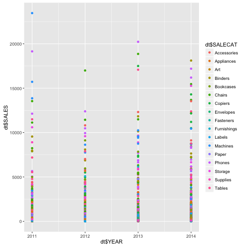

Super Store Analyzer
========================================================
Developing Data Products

Author: AKT

Date: 12/28/2015

Introduction
========================================================
type: section

This presentation is part of the Course Project for the Coursera Developing Data Products class. The peer assessed assignment has two parts. First, we need to create a Shiny application and deploy it on Rstudio's servers. Second, we should use Slidify or Rstudio Presenter to prepare a reproducible pitch presentation about the application. This presentation adresses the second part of the course project.
The app developed for the first part of the assignment is available at:https://adityaem.shinyapps.io/DSData_Products_Project

Source for ui.R and server.R files are available on the GitHub: https://github.com/adityaem/DSData_Products_Project/tree/master

Application Objectives
========================================================
type: section

Build a Shiny application leveraging UI controls integrated with efficient server side processing using reactive functions.
The Application is intended for Product managers and the Sales Team to analyze performance by product and geographic location.


```
  YEAR    STATE     SALECAT SALES PROFIT CUSTOMERS QTY TOTCUST
1 2011 illinois   Bookcases   918   -101        83  11      83
2 2011 illinois      Chairs  2509   -311       132  19     132
3 2011 illinois Furnishings   305   -210         9  33       9
```

Data & Background
========================================================
type: section

 
This demonstrates an interesting correlation between the different measures and overall sales performance.

Why the Super Store Analyzer?
========================================================
type: section

The Super Store Shiny Application can be used to identify the following key measures of a companies success
